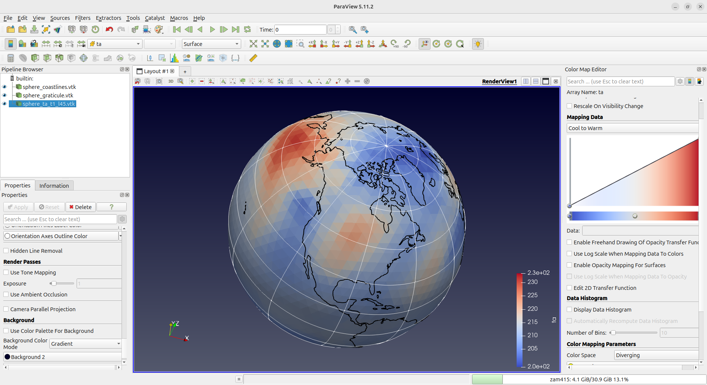
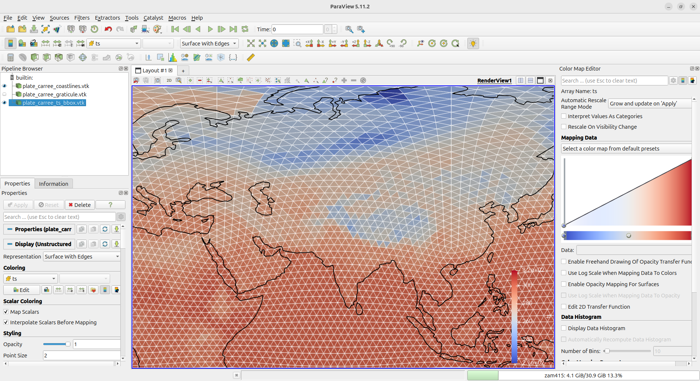

# ICON2VTK - ICON netCDF to VTK converter

[](https://github.com/slcs-jsc/icon2vtk/releases)
[](https://github.com/slcs-jsc/icon2vtk/commits/master)
[](https://github.com/slcs-jsc/icon2vtk/commits/master)
[](https://github.com/slcs-jsc/icon2vtk/tree/master/src)
[](https://github.com/slcs-jsc/icon2vtk/tree/master/src)
[](https://github.com/slcs-jsc/icon2vtk/tree/master/src)
[](https://github.com/slcs-jsc/icon2vtk/blob/master/COPYING)
[](https://archive.softwareheritage.org/browse/origin/?origin_url=https://github.com/slcs-jsc/icon2vtk)

This project provides a Python script, `icon2vtk.py`, that converts cell-based ICON model output from netCDF into legacy VTK files that can be opened directly in ParaView.

The script supports a broader workflow for exploratory visualization:

- export one or more 2-D ICON cell fields by selecting time and level indices
- subset the domain by a bounding box or circular region
- coarsen the mesh by one or more ICON refinement levels using parent-child metadata
- apply configurable radius offsets to fields and overlays
- write legacy VTK in ASCII or binary format
- add coastline and longitude-latitude graticule overlays
- print basic statistics for each exported field slice

The main script is:

- `icon2vtk.py`

## What the script does

ICON commonly stores atmospheric fields on an unstructured triangular grid. In the example files in this directory, the mesh geometry is stored separately from the actual model variables:

- the data file contains the variable values, for example `ts`, `pr`, or `ta`
- the grid file contains the triangular connectivity and the vertex coordinates

The script combines both:

1. It reads the ICON mesh from the grid file.
2. It reads one selected variable from the netCDF data file.
3. It resolves that variable to one or more 2-D slices by selecting time and level indices when needed.
4. It writes one or more legacy VTK files that ParaView can display as unstructured surfaces, either on the sphere or in `plate-carree` projection.

Optionally, it can also write additional VTK polyline files containing:

- coastlines
- graticule lines

These can be loaded into the same ParaView scene as overlays.

## Input assumptions

The current implementation is designed for cell-based ICON fields, meaning the exported variable must have an `ncells` dimension.

Typical supported shapes are:

- `(time, ncells)` for 2-D time-dependent fields
- `(time, height, ncells)` for 3-D fields on vertical levels
- `(time, singleton_dim, ncells)` for variables like 2 m temperature or 10 m wind

The script supports at most one non-singleton non-cell dimension besides `time`. In practice this means one horizontal field per timestep, optionally with one additional vertical or level-like index.

The script uses the ICON grid file to obtain:

- vertex coordinates
- triangle connectivity
- cell center coordinates for region selection

## Main files in this directory

- `icon2vtk.py`: the converter
- `example/icon_grid_*.nc`: ICON horizontal grid description
- `example/aes_amip_atm_2d_P1D_ml_19790101T000000Z.nc`: example 2-D ICON output
- `example/aes_amip_atm_3d_qp_ml_19790101T000000Z.nc`: example 3-D ICON output

## Requirements

Required Python packages:

- `numpy`
- `netCDF4`

Optional packages used only for coastline export:

- `cartopy`
- `shapely`

If you do not request coastlines, the script does not need Cartopy or Shapely.

## Installation

For a simple local setup, you can use the bundled `setup.sh` helper script to
create a virtual environment and install the dependencies from
`requirements.txt`:

```bash
bash setup.sh
```

The script creates `.venv`, activates it, upgrades `pip`, and installs the
required Python packages.

If you prefer to set up the environment manually, run:

```bash
python3 -m venv .venv
source .venv/bin/activate
pip install -r requirements.txt
```

After that, you can run the converter with:

```bash
python3 icon2vtk.py --help
```

If you do not need coastline support, the required packages are only:

- `numpy`
- `netCDF4`

If `cartopy` is difficult to install on your system, you can still use the script without coastline export.

## Quick start with example data

The easiest way to try the converter is to run the bundled example script from the `example/` directory:

```bash
cd example
bash run.sh
```

This writes a small set of VTK files back into `example/`:

- one sphere example using a 3-D field, one time index, one vertical level, coarsening, and overlays
- one `plate-carree` example using a 2-D field, clipped seam handling, and overlays

This is a good first check that:

- your Python environment can read the ICON netCDF files
- the optional overlay dependencies are installed if you requested coastlines
- ParaView can open the generated field and overlay files together

The example directory also contains saved ParaView state files and the corresponding generated files for both scenes:

- `example/sphere.pvsm`
- `example/sphere_ta_t1_l45.vtk`
- `example/sphere_coastlines.vtk`
- `example/sphere_graticule.vtk`
- `example/plate_carree.pvsm`
- `example/plate_carree_ts_bbox.vtk`
- `example/plate_carree_coastlines.vtk`
- `example/plate_carree_graticule.vtk`

Example screenshots are included as a quick visual reference:

### Sphere example



### Plate-carree example



## Basic command structure

The minimal command is:

```bash
python3 icon2vtk.py DATA.nc GRID.nc VARIABLE
```

For example:

```bash
python3 icon2vtk.py \
  example/aes_amip_atm_2d_P1D_ml_19790101T000000Z.nc \
  example/icon_grid_0049_R02B04_G.nc \
  ts
```

This reads the variable `ts` from the ICON netCDF data file, uses the ICON grid from the grid file, and writes `ts.vtk` in binary VTK format by default when you run the command from the repository root.

`--time-index` and `--level-index` accept either a single index or a comma-separated list of indices. When you pass multiple indices, the script exports one VTK file per selected slice combination and appends suffixes such as `_t0`, `_t1`, `_l45`, or `_t1_l45` to the output filename.

For example, to export two timesteps of a 2-D field:

```bash
python3 icon2vtk.py \
  example/aes_amip_atm_2d_P1D_ml_19790101T000000Z.nc \
  example/icon_grid_0049_R02B04_G.nc \
  ts \
  --time-index 0,1 \
  -o example/ts_batch.vtk
```

This writes:

- `example/ts_batch_t0.vtk`
- `example/ts_batch_t1.vtk`

If the grid file provides the ICON variable `parent_cell_index`, you can coarsen the exported field by one or more refinement levels:

```bash
python3 icon2vtk.py \
  example/aes_amip_atm_2d_P1D_ml_19790101T000000Z.nc \
  example/icon_grid_0049_R02B04_G.nc \
  ts \
  --coarsen-level 1 \
  -o example/ts_coarse.vtk
```

This groups complete four-child sibling families using `parent_cell_index`, reconstructs the parent triangle, and writes the average of the sibling values onto that coarser cell. Higher values such as `--coarsen-level 2` or `3` request repeated collapse of the same 4:1 refinement pattern.

Coarsening is applied on the full global ICON mesh first. If you also request
`--bbox` or `--circle`, that regional filtering is applied afterward on the
already coarsened mesh using the coarse cell centers.

Conceptually, each coarsening step replaces every complete four-child family by
its parent face, carries the mean of the four child values onto that parent,
and then repeats the same process on the next coarser mesh level.

Important details:

- `--coarsen-level` requires `parent_cell_index` in the grid file; otherwise the script exits with an error
- the requested level is an upper bound, not a guarantee; the script stops early if no further complete sibling families can be collapsed and reports `requested=... applied=...` after the export
- if you also subset the domain, incomplete families near the subset boundary are kept at their current resolution instead of being forced to coarsen
- higher coarsening levels should currently be treated as approximate for visualization; the cell count may collapse as expected, but exact parent-face connectivity is not guaranteed at the deepest levels

## Overlay-only mode

You can also generate coastline and graticule VTK files without exporting any ICON field.

This is useful when you only want to recreate the overlays for an existing ParaView scene.

For example, to generate only a graticule in `plate-carree` projection:

```bash
python3 icon2vtk.py \
  --projection plate-carree \
  --graticule-output example/graticule_only.vtk \
  --graticule-spacing 60 30
```

Or to generate only coastlines on the sphere:

```bash
python3 icon2vtk.py \
  --coastline-output example/coastlines_only.vtk \
  --coastline-resolution 10m
```

In overlay-only mode:

- no `DATA.nc GRID.nc VARIABLE` positional arguments are required
- `--bbox` and `--circle` still work
- `--projection`, seam handling, and radius offsets still apply
- the radius defaults to `6371229 m` unless you pass `--radius`

The same fixed default radius is also used for field export. If you need a different scale, pass `--radius` explicitly.

## Listing variables in a netCDF file

Before exporting, it is often useful to inspect which variables are available in a netCDF file without using `ncdump`.

You can do that with:

```bash
python3 icon2vtk.py example/aes_amip_atm_2d_P1D_ml_19790101T000000Z.nc --list-variables
```

or, for the 3-D example file:

```bash
python3 icon2vtk.py example/aes_amip_atm_3d_qp_ml_19790101T000000Z.nc --list-variables
```

The output lists each variable with its metadata and dimensions, followed by a coordinate summary that maps available time and level indices to their values.

Example:

```text
- ta: long_name="Temperature"; standard_name="air_temperature"; units=[K]
    dims=time, height, ncells; shape=(2, 90, 20480); grid=unstructured; dtype=float32

Coordinate values:

    time[0] = 1979-01-01T00:00:00
    time[1] = 1979-01-02T00:00:00

    height[0] = 1
    ...
```

This makes it easier to decide:

- which variable to export
- whether the variable is a 2-D field directly or needs time/level selection
- whether it lives on the ICON cell grid
- whether you will need `--time-index` and `--level-index`

## A first useful example

This is a good starting point for testing with a 2-D field:

```bash
python3 icon2vtk.py \
  example/aes_amip_atm_2d_P1D_ml_19790101T000000Z.nc \
  example/icon_grid_0049_R02B04_G.nc \
  ts \
  --time-index 1 \
  -o example/ts_t1.vtk
```

This tells the script:

- use the 2-D daily output file
- use the ICON grid file
- export the variable `ts`
- select the second time record via `--time-index 1`
- write the output to `example/ts_t1.vtk`

After the export, the script prints a short summary including:

- number of cells written
- number of finite values
- minimum value
- maximum value
- mean value

This is useful because some fields can be nearly zero, and the summary immediately tells you whether the data range is meaningful for visualization.

## Exporting 3-D variables

For variables with one additional non-singleton dimension besides `ncells`, the script needs:

- a time index
- a level index for that extra dimension

Example:

```bash
python3 icon2vtk.py \
  example/aes_amip_atm_3d_qp_ml_19790101T000000Z.nc \
  example/icon_grid_0049_R02B04_G.nc \
  ta \
  --time-index 1 \
  --level-index 45 \
  -o example/ta_t1_l45.vtk
```

Here:

- `ta` is air temperature
- `--time-index 1` selects the second available timestep
- `--level-index 45` selects one vertical model level

Both options also accept comma-separated lists such as `--time-index 0,1` or `--level-index 10,20,50`. In that case, the script exports one VTK file per selected slice combination.

The output is still a surface VTK file, not a full 3-D volume. In other words, the script writes one horizontal slice over the ICON sphere for the chosen level.

If a variable has more than one non-singleton non-cell dimension besides `time`, the script rejects it instead of guessing how `--level-index` should be applied.

## ASCII versus binary legacy VTK

By default, the script writes binary legacy VTK files:

```bash
--vtk-format binary
```

You usually do not need to specify this explicitly.

Binary output is recommended for most use cases:

- smaller file size
- faster read/write performance
- better suited for large ICON grids and batch processing
- when ParaView loading speed matters

ASCII output is mainly useful for debugging or inspection:

- human-readable text format
- easier to inspect or diff
- convenient for small test cases

However, ASCII files are significantly larger and slower to read and write.

To use ASCII instead of binary:

```bash
--vtk-format ascii
```

Example:

```bash
python3 icon2vtk.py \
  example/aes_amip_atm_2d_P1D_ml_19790101T000000Z.nc \
  example/icon_grid_0049_R02B04_G.nc \
  ts \
  --time-index 1 \
  --vtk-format ascii \
  -o example/ts_ascii.vtk
```

## Coastline overlays

The script can generate a separate VTK polyline file containing coastlines from Cartopy / Natural Earth.

This is useful because the ICON grid itself does not carry a general-purpose coastline line dataset suitable for plotting as a clean overlay.

Example:

```bash
python3 icon2vtk.py \
  example/aes_amip_atm_2d_P1D_ml_19790101T000000Z.nc \
  example/icon_grid_0049_R02B04_G.nc \
  ts \
  --time-index 1 \
  -o example/ts_with_coast.vtk \
  --coastline-output example/coastlines_10m.vtk \
  --coastline-resolution 10m \
  --coastline-radius-offset 1000
```

This command produces two files:

- `example/ts_with_coast.vtk`: the field on the ICON sphere
- `example/coastlines_10m.vtk`: the coastline overlay

### Coastline resolution

You can select one of three Natural Earth resolutions:

- `110m`: coarse, fast, small files
- `50m`: medium detail
- `10m`: highest detail, much larger files

Typical choice:

- use `110m` for quick checks
- use `10m` for more detailed regional figures

### Coastline radius offset
Coastlines can be written at a slightly larger radius than the field:

```bash
--coastline-radius-offset 1000
```

This helps avoid visual overlap or z-fighting when multiple datasets lie at nearly the same radius.

## Graticule overlays

The script can also create a geographic graticule, meaning a set of longitude and latitude lines.

This is often useful when showing regional subsets or when you want geographic orientation in a global view.

Example:

```bash
python3 icon2vtk.py \
  example/aes_amip_atm_2d_P1D_ml_19790101T000000Z.nc \
  example/icon_grid_0049_R02B04_G.nc \
  ts \
  --time-index 1 \
  -o example/ts_with_graticule.vtk \
  --graticule-output example/graticule_30x15.vtk \
  --graticule-spacing 30 15 \
  --graticule-radius-offset 2000
```

This writes:

- the field file
- a separate polyline VTK file containing longitude lines every 30 degrees and latitude lines every 15 degrees

### Why the name “graticule”?

`Graticule` is the standard cartographic term for the network of meridians and parallels, that is, longitude and latitude grid lines. It is the precise technical term, although “lat/lon grid” would also be understandable.

### Graticule spacing

The option:

```bash
--graticule-spacing DLON DLAT
```

controls the spacing in degrees.

Examples:

- `--graticule-spacing 30 15`
- `--graticule-spacing 60 30`
- `--graticule-spacing 10 10`

Smaller spacing gives more lines and a denser visual grid.

### Graticule radius offset
Like coastlines, the graticule can be lifted above the sphere:

```bash
--graticule-radius-offset 2000
```

This is often useful when field surfaces, coastlines, and grid lines are shown together.

## Field radius offset

The script can also lift the field surface itself:

```bash
--field-radius-offset 5000
```

This is especially useful when you want to display a regional subset above another surface without adding a separate `Transform` step in ParaView.

Example:

```bash
python3 icon2vtk.py \
  example/aes_amip_atm_2d_P1D_ml_19790101T000000Z.nc \
  example/icon_grid_0049_R02B04_G.nc \
  ts \
  --time-index 1 \
  --circle 10 50 1500 \
  --field-radius-offset 5000 \
  -o example/ts_circle_offset.vtk \
  --coastline-output example/coastlines_circle_offset.vtk \
  --coastline-resolution 10m \
  --coastline-radius-offset 6000
```

In that example:

- the field is lifted by 5000 m
- the coastlines are lifted by 6000 m

So the coastlines still remain slightly above the field.

## Regional subsetting by bounding box

You can restrict the export to a longitude-latitude box:

```bash
--bbox lon_min lat_min lon_max lat_max
```

Example:

```bash
python3 icon2vtk.py \
  example/aes_amip_atm_2d_P1D_ml_19790101T000000Z.nc \
  example/icon_grid_0049_R02B04_G.nc \
  ts \
  --time-index 1 \
  --bbox -15 30 35 72 \
  -o example/ts_europe.vtk \
  --coastline-output example/coastlines_europe.vtk \
  --coastline-resolution 10m \
  --coastline-radius-offset 1000
```

### How bbox selection works

For the ICON field itself:

- each triangular cell has a center longitude and latitude
- a cell is included if its center lies inside the requested box

For coastlines and graticules:

- the overlay linework is clipped or filtered to the same region

### Dateline crossing

If `lon_min > lon_max`, the script interprets the box as crossing the dateline.

That makes boxes such as:

```text
170 -20 -170 20
```

possible.

## Regional subsetting by circle

You can also select a circular region defined by:

- center longitude
- center latitude
- radius in kilometers

Syntax:

```bash
--circle lon_center lat_center radius_km
```

Example:

```bash
python3 icon2vtk.py \
  example/aes_amip_atm_2d_P1D_ml_19790101T000000Z.nc \
  example/icon_grid_0049_R02B04_G.nc \
  ts \
  --time-index 1 \
  --circle 10 50 1500 \
  -o example/ts_circle.vtk \
  --coastline-output example/coastlines_circle.vtk \
  --coastline-resolution 10m \
  --coastline-radius-offset 1000
```

### How circle selection works

For ICON cells:

- the script computes the great-circle distance from each cell center to the requested center point
- cells inside the requested radius are kept

For coastlines and graticules:

- the lines are filtered to the same circular region

This is useful for compact regional views centered on a city, country, or basin.

### Mutual exclusivity

You can use either:

- `--bbox`
- or `--circle`

but not both in the same command.

## Full example with field, coastlines, and graticule

```bash
python3 icon2vtk.py \
  example/aes_amip_atm_2d_P1D_ml_19790101T000000Z.nc \
  example/icon_grid_0049_R02B04_G.nc \
  ts \
  --time-index 1 \
  --circle 10 50 1500 \
  --field-radius-offset 5000 \
  -o example/ts_combo.vtk \
  --coastline-output example/coastlines_combo.vtk \
  --coastline-resolution 10m \
  --coastline-radius-offset 6000 \
  --graticule-output example/graticule_combo.vtk \
  --graticule-spacing 30 15 \
  --graticule-radius-offset 6500
```

This produces:

- a field surface
- a coastline overlay
- a longitude-latitude graticule

all as separate files that can be opened together in ParaView.

## ParaView workflow

A typical workflow in ParaView is:

1. Open the main field file.
2. Open any overlay files such as coastlines and graticule.
3. Click `Apply`.
4. Color the field by the exported scalar.
5. Set coastlines and graticule to a solid contrasting color.
6. Increase `Line Width` for the line datasets.

Useful settings for overlays:

- `Representation`: `Surface` or `Wireframe`
- `Coloring`: `Solid Color`
- `Line Width`: `2` to `4`

If the line datasets lie exactly on the field surface, they can visually interfere with it. That is the main reason the script supports separate radius offsets.

## Notes on the output format

The script writes legacy VTK files, not XML VTK files.

That means:

- field surfaces are written as `UNSTRUCTURED_GRID`
- coastlines and graticules are written as `POLYDATA`

This is an intentional choice because legacy VTK is simple and easy to generate directly from Python without additional VTK dependencies.

## Current limitations

At the moment, the script is focused on one specific use case:

- cell-based ICON variables on the horizontal grid

It does not currently handle:

- edge-based variables
- vertex-based variables
- vector field export as VTK vectors
- XML VTK output formats such as `.vtu` or `.vtp`

## Getting help

To see the full command-line help:

```bash
python3 icon2vtk.py --help
```

## Summary of the most important options

- `--time-index`: select one or more time records
- `--level-index`: select one or more vertical levels for slice export
- `--coarsen-level N`: coarsen by up to `N` ICON refinement levels when `parent_cell_index` is available
- `--vtk-format ascii|binary`: choose legacy VTK encoding
- `--bbox ...`: select a rectangular region
- `--circle ...`: select a circular region
- `--field-radius-offset`: lift the field surface
- `--coastline-output`: write coastline overlay
- `--coastline-resolution`: choose Natural Earth detail
- `--coastline-radius-offset`: lift coastline overlay
- `--graticule-output`: write longitude-latitude grid overlay
- `--graticule-spacing`: choose graticule spacing
- `--graticule-radius-offset`: lift graticule overlay

## Contact

If you have questions or need support, please feel free to get in touch.

Dr. Lars Hoffmann

Jülich Supercomputing Centre, Forschungszentrum Jülich

e-mail: <l.hoffmann@fz-juelich.de>
